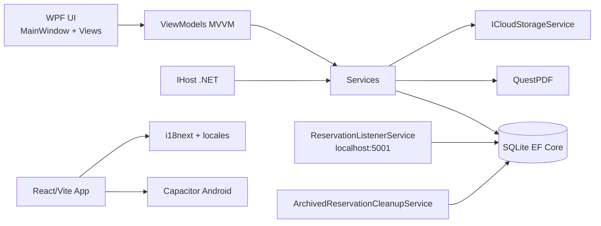

# Val de la Cascade

Ce dépôt contient deux applications complémentaires :

- Une application web/mobile React pour l'expérience client.
- Une application WPF .NET pour l'administration hôtelière.

## Sommaire

1. Vue globale
2. Architecture du dépôt
3. Mapping dynamique de l'infrastructure
4. Application React et mobile
5. Application WPF GestionReservations
6. Démarrage rapide
7. Commandes de maintenance

## Vue globale

Le front client est développé avec React + Vite + TypeScript + Tailwind v4 + PixiJS, puis packagé sur Android avec Capacitor.

Le back-office GestionReservations est une application WPF en .NET 8 organisée en MVVM (ViewModels, Views, Models, Services) avec :

- Entity Framework Core SQLite pour la persistance locale.
- MaterialDesignThemes pour l'interface.
- QuestPDF pour les confirmations PDF.
- Hosting et services de fond pour les traitements asynchrones.

## Architecture du dépôt

```text
.
├── src/                              # Front React/Vite
├── locales/                          # Traductions front
├── android/                          # Projet Android Capacitor
├── exports/                          # Ressources exportées
├── GestionReservations/              # Back-office WPF
│   ├── Models/                       # Entités métier et DTO
│   ├── Services/                     # Services infra et métier
│   ├── ViewModels/                   # Logique de présentation MVVM
│   ├── Views/                        # Vues XAML
│   ├── Documents/                    # Documents PDF
│   ├── App.xaml(.cs)                 # Entrée WPF
│   ├── MainWindow.xaml(.cs)          # Shell principal
│   └── GestionReservations.csproj
├── package.json                      # Scripts front
├── capacitor.config.json             # Configuration Capacitor
└── vite.config.ts                    # Configuration Vite
```

## Mapping dynamique de l'infrastructure

### 1) Cartographie logique runtime

Le diagramme ci-dessous représente les dépendances et flux principaux. Il doit rester aligné avec le code réel.



### 2) Génération dynamique de la cartographie fichiers

Depuis la racine du dépôt, cette commande PowerShell génère automatiquement un snapshot JSON de l'infrastructure (fichiers clés par couche) :

```powershell
Set-Location "d:\apk_val\apk_val"

$map = [ordered]@{
	generatedAt = (Get-Date).ToString("s")
	repository = "Val de la Cascade"
	front = [ordered]@{
		root = "src"
		keyFiles = @(
			"src/App.tsx",
			"src/main.tsx",
			"src/i18n.ts",
			"src/components"
		)
	}
	backOffice = [ordered]@{
		root = "GestionReservations"
		layers = [ordered]@{
			models = (Get-ChildItem "GestionReservations/Models" -File | Select-Object -ExpandProperty Name)
			services = (Get-ChildItem "GestionReservations/Services" -File | Select-Object -ExpandProperty Name)
			viewModels = (Get-ChildItem "GestionReservations/ViewModels" -File | Select-Object -ExpandProperty Name)
			views = (Get-ChildItem "GestionReservations/Views" -File | Select-Object -ExpandProperty Name)
			documents = (Get-ChildItem "GestionReservations/Documents" -File | Select-Object -ExpandProperty Name)
		}
	}
}

$map | ConvertTo-Json -Depth 6 | Set-Content "GestionReservations/infrastructure-map.json" -Encoding UTF8
Write-Host "Mapping généré: GestionReservations/infrastructure-map.json"
```

### 3) Vérification rapide de cohérence

Après toute modification structurelle :

```powershell
Set-Location "d:\apk_val\apk_val\GestionReservations"
dotnet build
```

## Application React et mobile

Fonctionnalités principales :

- Présentation de l'hôtel et de ses services.
- Module restaurant multilingue.
- Sections histoire et informations pratiques.
- Mini-jeu arcade PixiJS.
- Packaging Android via Capacitor.

Fichiers clés :

- src/App.tsx
- src/main.tsx
- src/i18n.ts
- src/components/restaurant/RestaurantSection.tsx
- src/components/hotel/HotelSection.tsx
- src/components/arcade/

## Application WPF GestionReservations

Organisation actuelle :

- Models : AppSettings, Client, Reservation, ReservationRequest, TranslationEntry.
- Services : AppDbContext, ReservationListenerService, ArchivedReservationCleanupService, QuestPdfService, JsonSettingsService, interfaces associées.
- ViewModels : MainWindow, Reservations, ReservationCard, Clients, Translations, Settings.
- Views : MainWindow et UserControls des modules.
- Documents : ReservationConfirmationDocument.

Flux technique principal :

1. App démarre un IHost et configure l'injection de dépendances.
2. MainWindow affiche les vues via DataTemplate + CurrentViewModel.
3. ReservationListenerService écoute les requêtes entrantes et effectue l'upsert des clients.
4. AppDbContext persiste les données dans SQLite.
5. QuestPdfService génère les documents de confirmation.

## Démarrage rapide

### Front React

```bash
pnpm install
pnpm dev
```

Scripts disponibles :

- pnpm dev
- pnpm build
- pnpm preview
- pnpm format

### Back-office WPF

```bash
dotnet build GestionReservations/GestionReservations.csproj
dotnet run --project GestionReservations/GestionReservations.csproj
```

### Android Capacitor

```bash
pnpm build
npx cap sync android
npx cap open android
```

## Commandes de maintenance

Vérifier les packages NuGet :

```powershell
dotnet list GestionReservations/GestionReservations.csproj package
```

Régénérer le mapping dynamique d'infrastructure :

```powershell
Set-Location "d:\apk_val\apk_val"
.\Generate-InfrastructureMap.ps1
```

Note : si vous utilisez la commande ci-dessus, créez préalablement le script Generate-InfrastructureMap.ps1 avec le contenu du bloc PowerShell de la section mapping dynamique.
